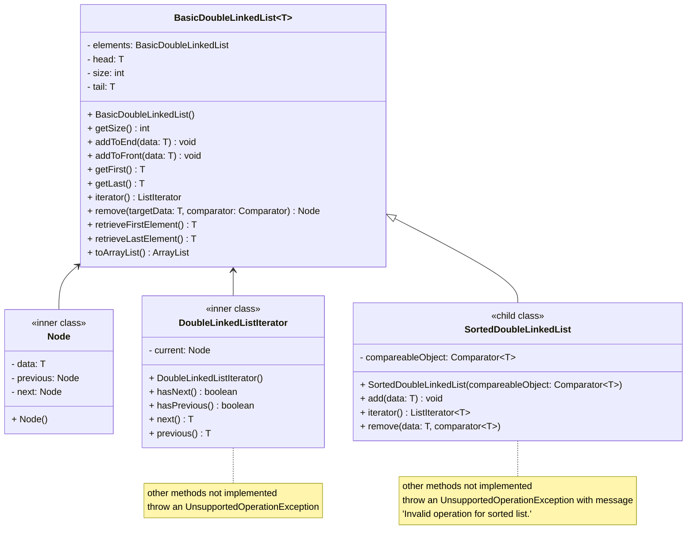

# Initial Assignment 3 Design
> - Nicholas Nguyen
> - [CMSC204 GitHub Repository](https://github.com/nick-nugat/cmsc204)
> - [*View on my website*](https://nick-nugat.github.io/coding-notes/project-designs/cmsc204/NguyenNicholas_Assignment3_Design/assignment3-design-initial)
___

## Pseudocode
%% barebones structure/layout %%
- generic class `BasicDoubleLinkedList<T>` that implements `Iterable` interface
	- inner class `Node`
	- generic inner class `DoubleLinkedListIterator<T>` that implements `ListIterator<T>` (from the java.util library)
	- other methods and fields of a doubly linked list implementation
- generic class `SortedDoubleLinkedList<T>` that extends `BasicDoubleLinkedList<T>`

## UML diagram
