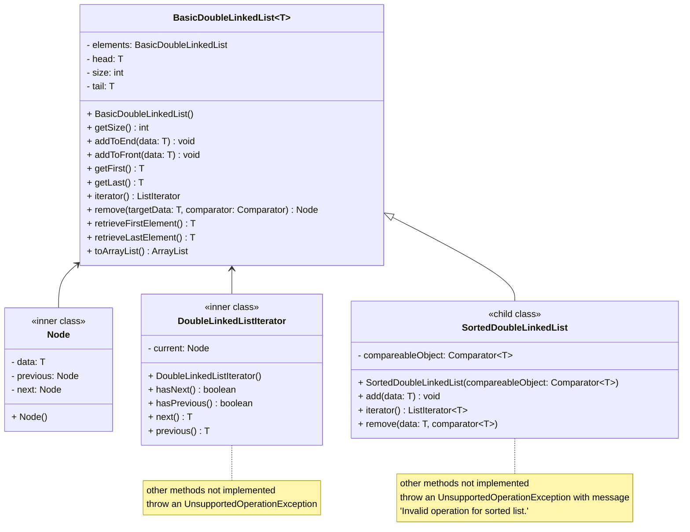

# Final Assignment 3 Design
- Nicholas Nguyen
- [CMSC204 GitHub Repository](https://github.com/nick-nugat/cmsc204)
- [*Note on website*](https://nick-nugat.github.io/coding-notes/project-designs/cmsc204/NguyenNicholas_Assignment3_Design/assignment3-design-initial)
___
## GitHub screenshot
![[assignment3-github-screenshot.png]]

## Learning experience
I felt that this project was pretty difficult, honestly. However, sitting down and taking the time to finally understand the concepts made things a lot easier when implementing my code.

I think I had the most trouble understanding where to point nodes to in certain situations, as well as what that meant in the context of the list. I also was confused about how I would implement the `add()` method in the `SortedDoubleLinkedList<T>` class.

I feel like this project taught me more about linked list—especially doubly linked lists—and how they can be used.

___
# Initial
## Pseudocode
%% barebones structure/layout %%
- generic class `BasicDoubleLinkedList<T>` that implements `Iterable` interface
	- inner class `Node`
	- generic inner class `DoubleLinkedListIterator<T>` that implements `ListIterator<T>` (from the java.util library)
	- other methods and fields of a doubly linked list implementation
- generic class `SortedDoubleLinkedList<T>` that extends `BasicDoubleLinkedList<T>`

## UML diagram
