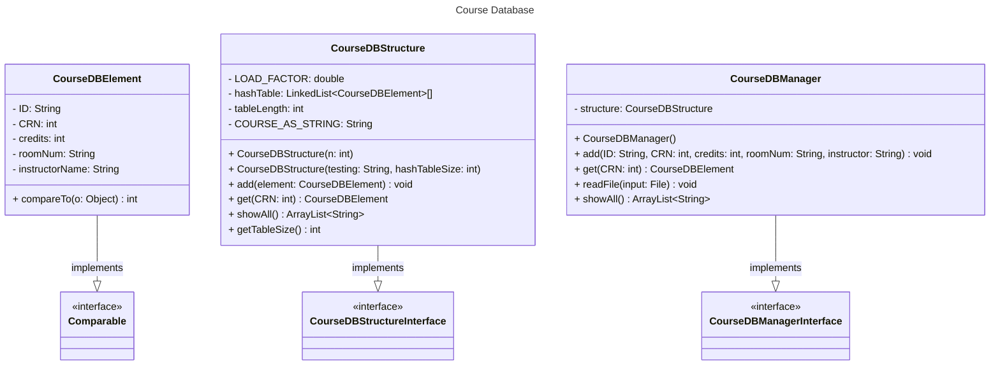

# Final Assignment 4 Design

- Nicholas Nguyen
- [CMSC204 GitHub Repository](https://github.com/nick-nugat/CMSC204)

___
## GitHub screenshot
![[assignment4-github-screenshot.png]]

## Learning experience
I enjoyed working on this project. I learned a good bit about concepts to use when implementing a database and especially about hashing and more about how it works.

I struggled with getting some tests to pass, as well as knowing what fields, methods, and constructors to have. Since there was no JavaDoc provided to follow like usual, I was a little thrown off, but I eventually got through it and found it to be nicer to learn by reading through the interfaces and figuring out how I may implement the methods listed in them.

## UML diagram

## Pseudocode
- `CourseDBElement`
	- blueprint for a course with attributes for the course id, crn number, room number, and instructor name
	- getters and setters for each attribute
- `CourseDBStructure`
	- represents a hash table with buckets
	- each hash code is based on the crn since unique to every course
- `CourseDBManager`
	- data manager class that allows users to read courses from a text file
	- uses `CourseDBStructure` quite a bit
		- calls some of its methods
	- can be used to enter data manually