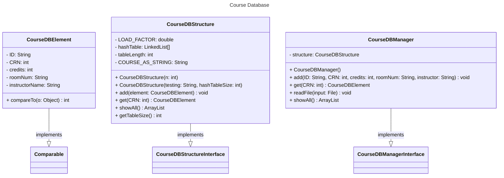

# [[assignment4-design]]
> Nicholas Nguyen
___
## UML diagram

## Pseudocode
- `CourseDBElement`
	- blueprint for a course with attributes for the course id, crn number, room number, and instructor name
- `CourseDBStructure`
	- represents a hash table with buckets
	- each hash code is based on the crn since unique to every course
- `CourseDBManager`
	- data manager class that allows users to read courses from a text file
	- can be used to enter data manually