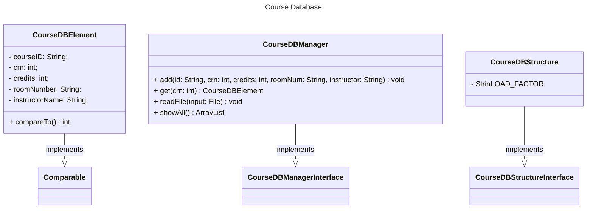

# [[assignment4-design]]
> Nicholas Nguyen
___

## UML diagram

```mermaid
---
title: Course Database
---
classDiagram
	direction BT

	Comparable <|-- CourseDBElement: implements
	CourseDBManagerInterface <|-- CourseDBManager: implements
	CourseDBStructureInterface <|-- CourseDBStructure: implements
	
	
	class CourseDBElement { 
	    - courseID: String;  
	    - crn: int;  
	    - credits: int;  
	    - roomNumber: String;  
	    - instructorName: String;  
	  
	    + compareTo() int
	}
	
	 class CourseDBManager{
		 + add(id: String, crn: int, credits: int, roomNum: String, instructor: String) void
		 + get(crn: int) CourseDBElement
		 + readFile(input: File) void
		 + showAll() ArrayList<String>
	 }
	
	 class CourseDBStructure{
		 - StrinLOAD_FACTOR$
	 }


```

## Pseudocode