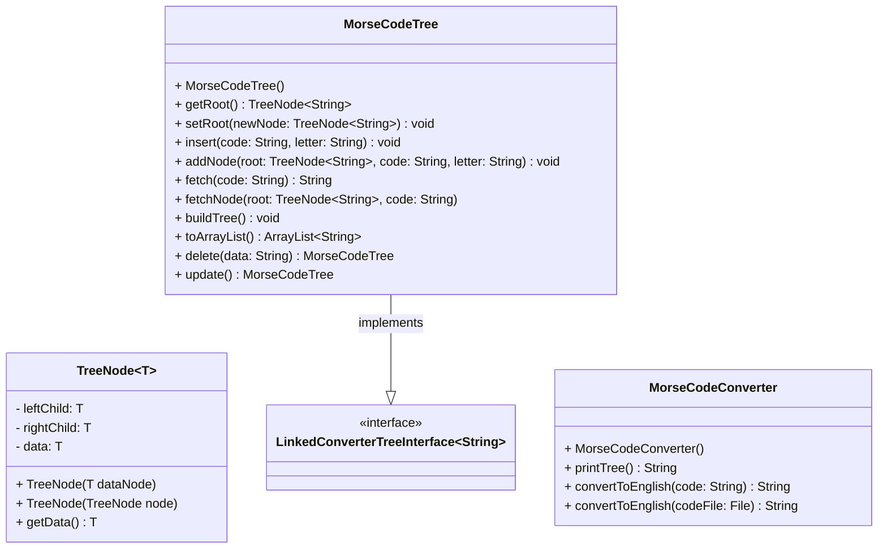

# [[assignment5-design-initial]]

> Nicholas Nguyen

___
%%
## GitHub screenshot

## Learning experience
%%

## UML diagram

## Pseudocode
This program is one that serves to convert Morse Code into English.

